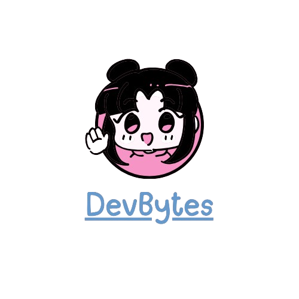

<h1 align="center">Hey 👋, I'm Saba Ali</h1>
<h3 align="center">Web3 Developer | Blockchain Engineer | DApp Builder from Pakistan 🇵🇰</h3>

  

  

---

### 🚀 About Me

- 🔭 I’m currently working on **SmartStay**, a blockchain-powered rental platform.
- 🌱 Learning deeply about **Smart Contracts**, **ZK Tech**, **TanStack**, and **MERN Stack**.
- 💡 Passionate about building **secure**, **scalable**, and **user-friendly** decentralized applications.
- 📹 I share my journey and tutorials on **[DevBytes YouTube Channel](https://www.youtube.com/@DevBytes6)**.
- ⚡ Fun fact: I can turn coffee ☕ into deployed smart contracts.

---

### 🛠 Tech Stack & Tools

  
  
  
  
  
  
  
  
  

---

### 🌐 Connect With Me

  
  
  

---

### 📊 GitHub Stats

  
  

  

---

### 🏆 GitHub Trophies

  

---

### 🐍 Activity Snake

  

---

> “Code with purpose. Build with heart. Deploy with confidence.”

---

